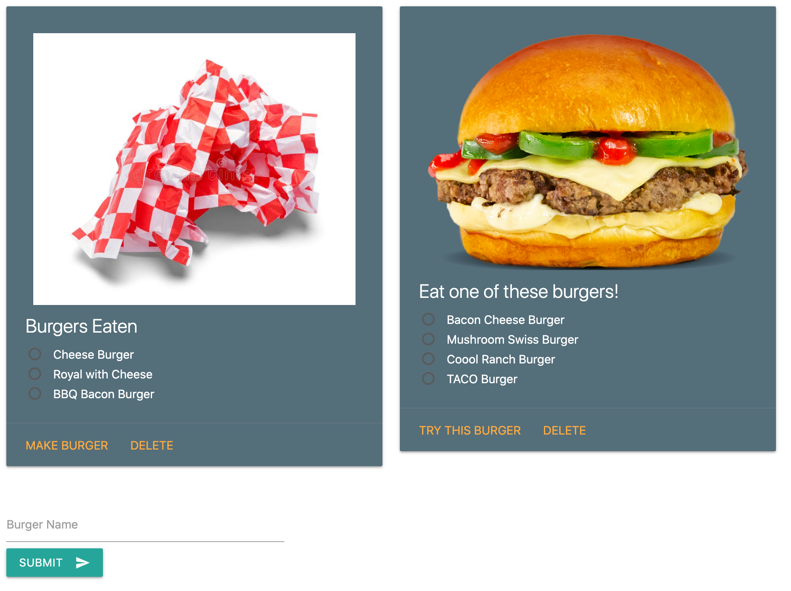

    
 
# Project name : BURGERTIME

[hw13-handlebars](https://github.com/trilambda122/hw13-handlebars)
---
## Table of Contents

[Description](#description)...

[Installation Requirements](#installtion-requirments)...

[Useage](#useage)...

[License](#License)...

[Contribitors](#Contribitors)...

[Tests](#Tests)...

[Questions](#Questions)...

[Application Screen Shots](#ScreenShots)...

---
## Description
Fun app to create and eat burgers! Well, mostly, it demonstrates the MVC structure and the use of ORM. 

---

## Installtion requirments
None.. its loacted on heroku

---
## Useage
Just go to https://radiant-brook-63158.herokuapp.com

---
## License
NOTICE This application is covered under MIT License license.
Please see license.md file for more information 

---
## Contribitors 

trilambda122

---
## Tests
tedious 

---
## Questions

Github profile can be found here:  http://github.com/trilambda122

Please direct any additonal questions to: trilambda122@gmail.com

---
## ScreenShots

*SCREEN SHOT 1*

